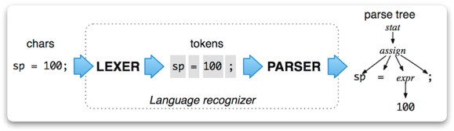
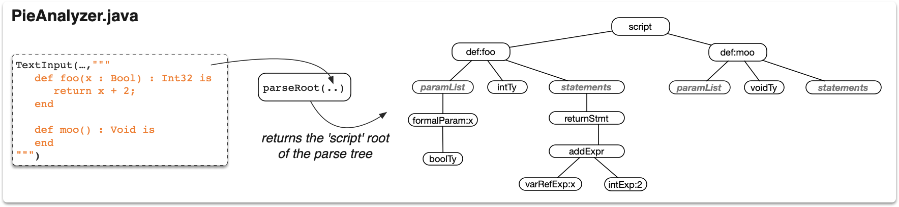
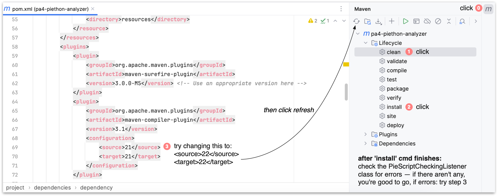
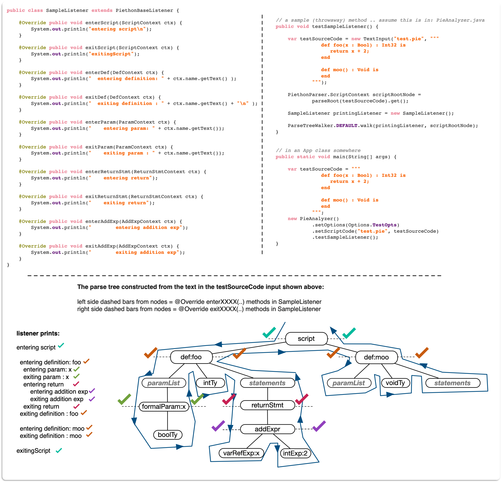
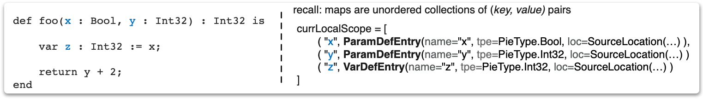
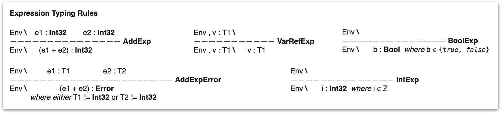
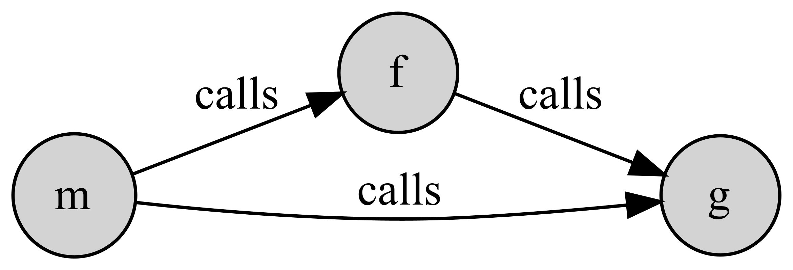

## Trees in Vivo: implementing a static typechecker and control flow visualization for *Piethon* programs

In this final PA, you will expand on your experience building and traversing 
hierarchical data structures to do some basic semantic analysis on `piethon` scripts -- a statically typed 
programming language inspired by Python. 

The assignment aims to give you some exposure to working with larger parsing libraries in addition to some 
experience in working with structured text and how one can go about implementing 
static analyzers, compilers, interpreters, and [Domain Specific Languages (DSLs)](https://en.wikipedia.org/wiki/Domain-specific_language#:~:text=A%20domain%2Dspecific%20language%20(DSL,is%20broadly%20applicable%20across%20domains ) 

Piethon includes the following syntactic constructs:
* procedure, formal parameter, and local variable definitions, 
* call, variable-assignment, and `return` statements,
* numeric and boolean types and expressions.

`If-else` as well as the usual imperative iteration statements (`while` and `for`)
are omitted to keep things relevatively simple. Below is a small sample 
`.pie` script for a look at the basic syntax:

```python
// a line comment 
def add_two (base : Int32, amt : Int32) : Int32 is         
    var result : Int32 := base + amt;   // a variable def + initialization
    return result;                      // a return stmt
end

def main () : Void is
    add_two(5, 2); // will return 7 
end
```
Here, `add_two` is a procedure definition that takes two formal parameters, `base` and
`amt` (both of type `Int32`) and returns their sum; all the `main` method 
does is call the `do_nothing` method --- ignoring the value returned from the 
call to `add_two(..)`

## Piethon Concrete Syntax 

Piethon can be described as a tiny imperative language with minimal syntax 
that can be expressed using so-called [Backus Naur Form](https://en.wikipedia.org/wiki/Backus%E2%80%93Naur_form) (BNF) notation. For 
example, we can specify 'the shape' of a piethon variable definition using the 
BNF grammar rule:

```antlr4 
varDef
    :   'var' name=ID ':' type=ty ':=' exp ';'
    ;
    
ty : 'Bool' | 'Int32' | 'Void'

// see Piethon.g4 for the full grammar including the exp rule
```
This can be read as:

> A variable definition always starts with the keyword 'var' 
> proceeded by an identifier (ID), a colon character ':', a type (ty), and
> finally an initialization expression (':=' exp). A type can be either:
> Bool, Int32, or Void.
> 
> (read the '|' as 'or')
> 
> Variable definitions always terminate with a semicolon ';'

Some concrete examples that satisfy this grammar rule:
* `var moo : Int32 := 0;`
* `var another_var : Bool := true;`

To parse raw java strings into actual piethon syntax trees, in this PA you'll
be using a popular *parser generator* called [Antlr4](https://github.com/antlr/antlr4). GNU Yacc and Bison is another 
well-known parsing and lexing tool (albeit for C, C++).

Basically, given a formal BNF description of a language (piethon's is given in 
`src/antlr4/Piethon.g4`), antlr4 will automatically generate a state-machine/recognizer that 
accepts a raw Java string containing the program, and either accepts or rejects it 
according to the grammar rules specified in the `.g4` file for the language. 

If the string is accepted, antlr4 will produce a **Parse Tree** (sometimes called a 'Concrete Syntax Tree') 
along with 'listener' classes to facilitate pre- and post-order traversals over tree. A high level example of the 
parsing process is pictured below.



### key syntactic categories 

As with all programming languages, we can classify syntax into several different buckets:
1. **definitions** -- things that are named and must be declared such that we can refer back to them later on in the file; any parser rule
whose name is suffixed with `def` is a form of definition.
2. **statements** -- individual instructions that can only go in methods; these include: procedure call stmts, assignment stmts, etc.; these all must end with a semicolon.
3. **expressions** -- in our small language this includes just boolean and integer expressions (e.g., `1 + 2` is an expression)

**NOTE:** if a string is accepted by the piethon grammar, this does not mean that the 
string contains a valid piethon program -- just that it adheres to the syntax. 
A significant portion of this PA will involve checking whether the parsed string 
is valid or not.

For example, the following piethon program string is syntactically valid, but *semantically* 
invalid: 
```python
def fun(x : Int32) : Bool is
  return z;       // referring to some var z.. not defined!
end 
```
There are many examples of syntactically correct but invalid programs, here are some more:
```python
def fun(x : Int32, x : Bool) : Void is // duplicate name x in scope
end

def fun(x : Int32) : Int32 is  // err: duplicate procedure named 'fun' 
   return true; // type err: true is of type: Bool (not Int32) 
end 
```
That is, the space of syntactically correct piethon code snippets is enormous. Though the 
space of piethon code that is both syntactically correct **and** semantically 
valid is narrower (but still pretty large).

## Architectural overview

The key file that drives most of the work is the `PieAnalyzer` class. This is given 
as part of the starter kit and serves as the frontend API class for the entire tool. 
The parser is already hooked up for you in this class. 

Below is an example of analyzer class' `parseRoot(..)` being passed in 
input that contains a sample piethon script with two procedure definitions (left)
and the resulting parse tree (right).



Note: the picture above elides some of the detail present in the actual 
parse tree (such as appearances of keywords, semicolons, commas, etc.). That said, the 
structure of the real parse tree and the simplified one shown above is preserved. 

### Antlr4 tree listeners in a nutshell 

Below is a snippet of a 'tree listener' class that will perform the semantic checks on 
the generated parse trees: 
```java
public class PieScriptCheckingListener extends PiethonBaseListener {
    
    private final Map<String, SymbolTableEntry.ProcDefEntry> procedures =
            new HashMap<>();
    // ... (see starter kit for some additional fields)
```

Note that this class `extends PiethonBaseListener`, which is an abstract class 
generated by antlr4. In fact, before proceeding, make sure antlr4 is working in 
your cloned repo -- see the maven instructions below:



The `PiethonBaseListener` class contains `enterXXXXX` and `exitXXXX` 
corresponding to each grammar rule in `Piethon.g4`.

Any 'tree listener' class you define should extend `PiethonBaseListener` 
(do not edit this class itself as it is automatically regenerated by antlr4 
each time the project is recompiled)

### Example: a node printing listener 

To perform a pre- or post-order traversal over an antlr4 generated tree, we can 
create a listener class that `extends PiethonBaseListener`. We'll make a small sample 
listener that prints a message to the console each time we 'enter' or 'exit' node 
in the parse tree for the following:

* a script context node
* a procedure definition context node 
* a parameter definition context node
* a return statement context node
* and an add expression context node

Pictured below on the left is the listener class that prints the messages, 
and a corresponding visualization of the pre-/post-order traversal over the 
parse tree for the program (bottom, with resulting listener printout on left).



A few notes about tree listener classes... 
1. you don't have to @Override every node -- only those for which you want to 
respond to in some way when encountered in the file
2. all antlr4 parse tree nodes (such as: `ScriptContext`, `DefContext`, etc.) extend from a common base class: 
`ParserRuleContext` 
3. while you don't often need to @Override the `enterXXXX` methods, you sometimes will want to if you certain 
global info/fields set and available before you visit the child nodes. 

## Task 1: implementing `PieScriptCheckingListener`

By this point, your project should be picking up the `PiethonBaseListener` class 
and there shouldn't be errors. 

You've been given some predefined fields in the `PieScriptCheckingListener` 
class -- and it's already hooked into the compilation pipeline's `check()` method 
(in `PiethonAnalyzer`).

The bulk of the work will be done in the `PieScriptCheckingListener` class and 
it can be split into two steps: (A) and (B).

### (A) Populating a per-procedure symbol table 

In this first part, you'll be checking that all variables are declared and are 
used in a type correct way within expressions. In order to do this, you'll need 
to keep track of all the variables present in the current procedure being walked. 
I.e.: you'll need to build up a *symbol table*. Having a symbol table 
will allow you to look up information about any variables referenced within the code 
(e.g., when typechecking expressions). 

The symbol table you will use for this PA is barebones, it's represented as two maps:

```java
// in PieScriptCheckingListener.java
/**
 * First, a map that keeps track of all global procedures seen so far in
 * the script. This shouldn't get erased at any point during the walk.
 */
private final Map<String, SymbolTableEntry.ProcDefEntry> procedures =
        new HashMap<>();

/**
 * Second, a map that holds the local scope for the procedure currently being 
 * walked.
 * <p>
 * Invariant: this will map strings (identifiers) to either: formal parameters or 
 * variables definitions (procedures can't be defined within other procedures)
 */
private Map<String, SymbolTableEntry> currLocalScope;
```
The only construct in Piethon that introduces variable scope are procedure definitions.

* the `procedures` map shown should only be updated in the `@Override exitDef(..)` method 
(after all child nodes of that procedure have been visited/walked);

Essentially, each time you enter a procedure definition (in the `@Override enterDef(..)` method), 
the very first thing you'll need to do is reinitialize the `currLocalScope` to a `new HashMap<>()` 
(to give a fresh scope for the procedure about to be processed). 

Next, as the children of the procedure are walked, you will need map each variable 
definition and parameter definition name you encounter to a corresponding `SymbolTableEntry`. 

Here's en example illustrating the scope mapping for a sample procedure. This map 
gets incrementally update while walking the children of a procedure def node. NOTE: the map 
shown in the picture is after all children of procedure foo have been walked.



Here the `currentLocalScope` (sometimes referred to as an *environment*) maps the names of any local variables or formal parameter definitions encountered during 
the walk to a corresponding `SymbolTableEntry` type that stores: the name, datatype (`tpe`) for the symbol, as well as its 
`SourceLocation`. 

* **Detecting duplicate variable or parameter definitions:** when walking a `varDef` or `paramDef` and you find there already exists a key with its name in the `currLocalScope` map, 
this means there is a name clash, so you should add a `new SemanticError.DupSymbol(..)` instance to the errors list. 

The `PieScriptCheckingListener` class already contains a utility method, `mkSL(..)`, that takes a raw `ParserRuleContext` (a common supertype for all anltr4 syntax nodes in the tree)
and produces a `SourceLocation` object that records line, column, and the relative span of the entity in the source file. 

### (B) Typechecking expressions + additional semantic checks

Since Piethon does not support generic or user-defined datatypes, we can represent all valid types 
(`Int32`, `Void`, `Bool`) using a simple `PieType` enum, which is included in the PA starter kit.

Every expression in the source code needs a `PieType` assigned to it. Below is an example showing how 
one might typecheck the expression appearing within a return statement.


Piethon's typechecking rules can be summarized/made-precise using so-called 
"judgement" notation:

```
Env \ P1     P2
---------------- RuleName
Env \     C
```
You can read the rule titled RuleName above like so: 

> "if we know the premeses P1 and P2 are true in the scope/environment (Env), then 
we can derive the conclusion `C` below the line."

Anything listed before the \ in these rules are things assumed to be available 
(lookup-able) within the environment. 

Below are the typechecking judegement rules for Piethon for expressions:



Most of these we would call *axioms* since they have no premises -- except the rule for addExps which 
requires expressions *e1* and *e2* (the left and right expressions) to both be of type `Int32`.

**Once expressions are typechecked and each expression is assigned a PieType**, you can now incoporate the following 
additional semantic checks (most of which require type information to be present): 

* can't assign `true` or `false` to variables or parameters of a type `Int32`
  and numeric literals (like `0`, `1`, `2`, etc.) to variables of type `Bool`.
  <br>
  <br>
* **warning - fairly involved**: call statements must be correct from a typing perspective. You'll need to
ensure three things:
  1) the called operation exists and is in scope;
  2) the number of arguments 
  passed in matches the number of formal parameters for the procedure being called and;
  3) the types of the actual arguments passed into the called procedure match the expected types as 
  defined by the called procedure's formal parameter list 
     <br>
     <br>
* any procedure with a non-`Void` return type must end in a single `return` statement
  (and the type of the expression being returned must match the procedure's declared return type)
  <br>
  <br>
* procedures and variables must be defined before they are used in the script, e.g. the
  main in the sample piethon script above can call `do_nothing` as it's
  defined before being called (Piethon does not support forward references).
  <br>
  <br>
* further, any variables duplicated (variables with the same name) that clash within the 
same scope must also trigger an error that gets accumulated during the analysis treewalk.

## Task 2: Unit testing

I've included what are termed *negative tests* in the `PieAnalyzerTests` class. You 
should add tests for program fragments of varying size and complexity to ensure that 
the analyzer is properly flagging ALL invalid piethon programs. Bad ones shouldn't get 
through without getting flagged. 

* Don't skimp on these tests, the walk occurring is fairly intricate and there is a lot of global 
state in the pie analyzer -- you should convince yourself that it's working.

## Task 3: Generating a call graph 

A call graph is a directed (in our case acyclic) graph where the nodes are 
procedures appearing in the script and an edge from one node *A* to another node *B* 
implies that procedure *A* includes a call to procedure *B*.

For example, the following script:

```python
def g() : Void is
end

def f() : Void is
    g();
end

def m() : Int32 is
    f();
    g();
    return 0;
end
```
would generate call graph that looks like the following:



The starter kit includes a `PieGraphBuildingListener` class as well as a `Digraph` class
generic in the type nodes. This class is implemented using an adjacency list
(a java.util.Map in practice).

In the `PieGraphBuildingListener` class, you will need to build up a call graph
using the `Digraph` class included in the `utils` package.

You'll just need to add code to: `PieGraphBuildingListener` to build the graph 
based on the currently set piethon script. 
* each time you see a procedure, add a node to the graph
* each time you see call statement, you'll need to know what procedure you're currently within
then add an edge from that procedure to the one being called.
 
Once the graph has been built up by your listener, the `exportGraph` method in `PieAnalayzer` should be implemented 
to write a `.png` of the call graph to the root directory of the project.

**Please try to make yours look visually nicer and more colorful than mine** -- i.e.: the one pictured above .. shouldn't be too hard :-) 
I used this fairly stale/old [library](https://github.com/nidi3/graphviz-java) generate the image the dependency for it is already included in the maven `pom.xml`.

If you opt to use another library -- you must add the dependency for it to your `pom.xml` and 
it must hook in seamlessly and generate a PNG. 

## Task 3: Reflection

Write a 3/4-page reflection on what you added, and any major stumbling blocks. Talk about 
any features you would like to add to the piethon and estimate how difficult it might be to 
implement...

* **also:** if you *do* successfully add any additional features to the language 
(e.g.: adding `if else` statements or allowing calls to be embedded within expressions)
document this! Note: many extra things will require you to rethink how scoping is handled + you'll have to modify the grammar 
(Piethon.g4)

# Handin

When you are ready to submit (or simply want to 'checkin' your work for the day),
open the terminal, cd to the project directory, make a commit by typing:

> git commit -am "message goes here"

then follow this up with a

> git push origin main
